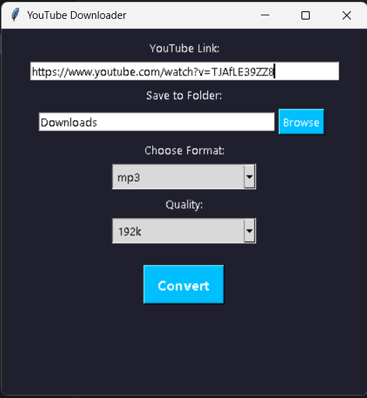

# YouTube Downloader

YouTube downloader is a python desktop application designed to download videos from Youtube in mp3 or mp4 format for educational purposes. The application has an intuitive graphical interface that allows the user to paste the corresponding link to the video, choose the format and quality of the video that is desired to be downloaded.

## Supported formats

The videos can be downloaaded in MP3 or MP4 format. The application can also receive links from playlists, thus downloading all videos in the format specified by the user.

## Purpose of the application

The purpose is to explore concepts such as the use of video/audio processing libraries and interaction with web pages. Downloading and distribution of copyrighted content is not encouraged.

## Features:
- download individual videos from the youtube platform
- download entire playlists 
- smart clipboard detection: auto-paste YouTube link
- you can choose the desired format (MP3/MP4)
- intuitive interface: the possibility of inserting the link, selecting the format, the possibility of downloading
- portable executable (.exe) included

## Portable Version

This project includes a portable `.exe` file built with `PyInstaller`.

1. Go to the `dist/` folder (included in the project).
2. Run `YouTubeDownloader.exe` directly — no Python required.  
Note: Windows might show a security warning when launching an unknown `.exe`. Just click "More info" → "Run anyway".

## Technologies Used

- Python 3
- Tkinter – for GUI
- yt-dlp – YouTube video downloader engine
- Mutagen – to embed metadata and thumbnails into MP3s
- PyInstaller – to build the `.exe` file

## Disclaimer

This tool is for **educational purposes only**.  
Please respect copyright laws and YouTube's terms of service.  
**Do not use this application to download copyrighted content.**

## Screenshots

## Author

Made by **SCARLAT ALEXANDRA NICOLETA**
